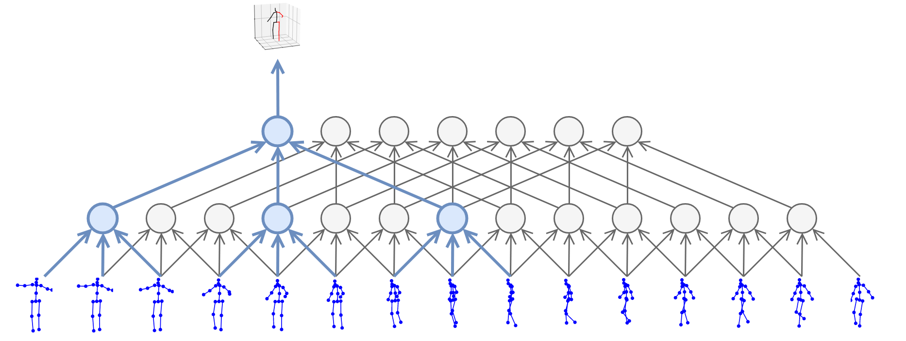
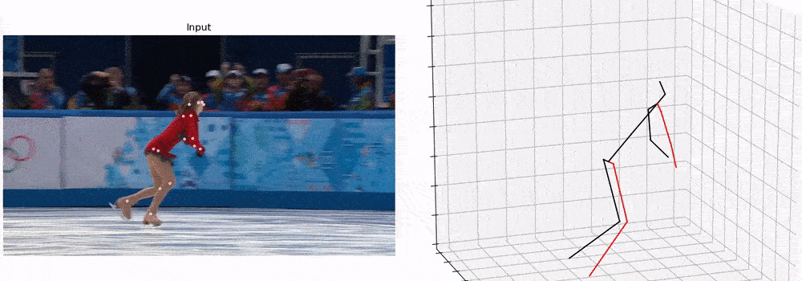
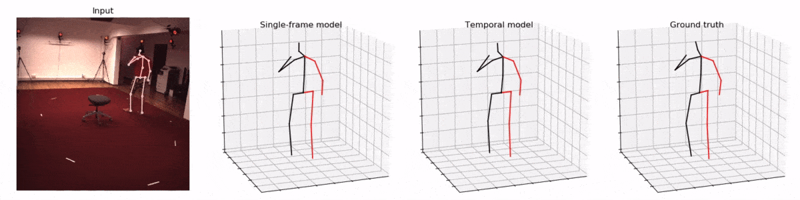

# 3D human pose estimation in video with temporal convolutions and semi-supervised training
<p align="center"></p>

This is the implementation of the approach described in the paper:
> Dario Pavllo, Christoph Feichtenhofer, David Grangier, and Michael Auli. [3D human pose estimation in video with temporal convolutions and semi-supervised training](https://arxiv.org/abs/1811.11742). In *arXiv*, 2018.

More demos are available at https://dariopavllo.github.io/VideoPose3D

<p align="center"></p>



### Results on Human3.6M
Under Protocol 1 (mean per-joint position error) and Protocol 2 (mean-per-joint position error after rigid alignment).

| 2D Detections | BBoxes | Blocks | Receptive Field | Error (P1) | Error (P2) |
|:-------|:-------:|:-------:|:-------:|:-------:|:-------:|
| CPN | Mask R-CNN  | 4 | 243 frames | **46.8 mm** | **36.5 mm** |
| CPN | Ground truth | 4 | 243 frames | 47.1 mm | 36.8 mm |
| CPN | Ground truth | 3 | 81 frames | 47.7 mm | 37.2 mm |
| CPN | Ground truth | 2 | 27 frames | 48.8 mm | 38.0 mm |
| Mask R-CNN | Mask R-CNN | 4 | 243 frames | 51.6 mm | 40.3 mm |
| Ground truth | -- | 4 | 243 frames | 37.2 mm | 27.2 mm |

## Quick start
To get started as quickly as possible, follow the instructions in this section. This should allow you train a model from scratch, test our pretrained models, and produce basic visualizations. For more detailed instructions, please refer to [`DOCUMENTATION.md`](DOCUMENTATION.md).

### Dependencies
Make sure you have the following dependencies installed before proceeding:
- Python 3+ distribution
- PyTorch >= 0.4.0

Optional:
- Matplotlib, if you want to visualize predictions. Additionally, you need *ffmpeg* to export MP4 videos, and *imagemagick* to export GIFs.
- MATLAB, if you want to experiment with HumanEva-I (you need this to convert the dataset). 

### Dataset setup
You can find the instructions for setting up the Human3.6M and HumanEva-I datasets in [`DATASETS.md`](DATASETS.md). For this short guide, we focus on Human3.6M. You are not required to setup HumanEva, unless you want to experiment with it.

In order to proceed, you must also copy CPN detections (for Human3.6M) and/or Mask R-CNN detections (for HumanEva).

### Evaluating our pretrained models
The pretrained models can be downloaded from AWS. Put `pretrained_h36m_cpn.bin` (for Human3.6M) and/or `pretrained_humaneva15_detectron.bin` (for HumanEva) in the `checkpoint/` directory (create it if it does not exist).
```sh
mkdir checkpoint
cd checkpoint
wget https://s3.amazonaws.com/video-pose-3d/pretrained_h36m_cpn.bin
wget https://s3.amazonaws.com/video-pose-3d/pretrained_humaneva15_detectron.bin
cd ..
```

These models allow you to reproduce our top-performing baselines, which are:
- 46.8 mm for Human3.6M, using fine-tuned CPN detections, bounding boxes from Mask R-CNN, and an architecture with a receptive field of 243 frames.
- 28.6 mm for HumanEva-I (on 3 actions), using pretrained Mask R-CNN detections, and an architecture with a receptive field of 27 frames. This is the multi-action model trained on 3 actions (Walk, Jog, Box).

To test on Human3.6M, run:
```
python run.py -k cpn_ft_h36m_dbb -arc 3,3,3,3,3 -c checkpoint --evaluate pretrained_h36m_cpn.bin
```

To test on HumanEva, run:
```
python run.py -d humaneva15 -k detectron_pt_coco -str Train/S1,Train/S2,Train/S3 -ste Validate/S1,Validate/S2,Validate/S3 -a Walk,Jog,Box --by-subject -c checkpoint --evaluate pretrained_humaneva15_detectron.bin
```

[`DOCUMENTATION.md`](DOCUMENTATION.md) provides a precise description of all command-line arguments.

### Training from scratch
If you want to reproduce the results of our pretrained models, run the following commands.

For Human3.6M:
```
python run.py -e 80 -k cpn_ft_h36m_dbb -arc 3,3,3,3,3
```
By default the application runs in training mode. This will train a new model for 80 epochs, using fine-tuned CPN detections. Expect a training time of 24 hours on a high-end Pascal GPU. If you feel that this is too much, or your GPU is not powerful enough, you can train a model with a smaller receptive field, e.g.
- `-arc 3,3,3,3` (81 frames) should require 11 hours and achieve 47.7 mm. 
- `-arc 3,3,3` (27 frames) should require 6 hours and achieve 48.8 mm.

You could also lower the number of epochs from 80 to 60 with a negligible impact on the result.

For HumanEva:
```
python run.py -d humaneva15 -k detectron_pt_coco -str Train/S1,Train/S2,Train/S3 -ste Validate/S1,Validate/S2,Validate/S3 -b 128 -e 1000 -lrd 0.996 -a Walk,Jog,Box --by-subject
```
This will train for 1000 epochs, using Mask R-CNN detections and evaluating each subject separately.
Since HumanEva is much smaller than Human3.6M, training should require about 50 minutes.

### Semi-supervised training
To perform semi-supervised training, you just need to add the `--subjects-unlabeled` argument. In the example below, we use ground-truth 2D poses as input, and train supervised on just 10% of Subject 1 (specified by `--subset 0.1`). The remaining subjects are treated as unlabeled data and are used for semi-supervision.
```
python run.py -k gt --subjects-train S1 --subset 0.1 --subjects-unlabeled S5,S6,S7,S8 -e 200 -lrd 0.98 -arc 3,3,3 --warmup 5 -b 64
```
This should give you an error around 65.2 mm. By contrast, if we only train supervised
```
python run.py -k gt --subjects-train S1 --subset 0.1 -e 200 -lrd 0.98 -arc 3,3,3 -b 64
```
we get around 80.7 mm, which is significantly higher.

### Visualization
If you have the original Human3.6M videos, you can generate nice visualizations of the model predictions. For instance:
```
python run.py -k cpn_ft_h36m_dbb -arc 3,3,3,3,3 -c checkpoint --evaluate pretrained_h36m_cpn.bin --render --viz-subject S11 --viz-action Walking --viz-camera 0 --viz-video "/path/to/videos/S11/Videos/Walking.54138969.mp4" --viz-output output.gif --viz-size 3 --viz-downsample 2 --viz-limit 60
```
The script can also export MP4 videos, and supports a variety of parameters (e.g. downsampling/FPS, size, bitrate). See [`DOCUMENTATION.md`](DOCUMENTATION.md) for more details.

## License
This work is licensed under CC BY-NC. See LICENSE for details. Third-party datasets are subject to their respective licenses.
If you use our code/models in your research, please cite our paper:
```
@article{pavllo:videopose3d:2018,
  title={3D human pose estimation in video with temporal convolutions and semi-supervised training},
  author={Pavllo, Dario and Feichtenhofer, Christoph and Grangier, David and Auli, Michael},
  journal={arXiv},
  volume={abs/1811.11742},
  year={2018}
}
```
